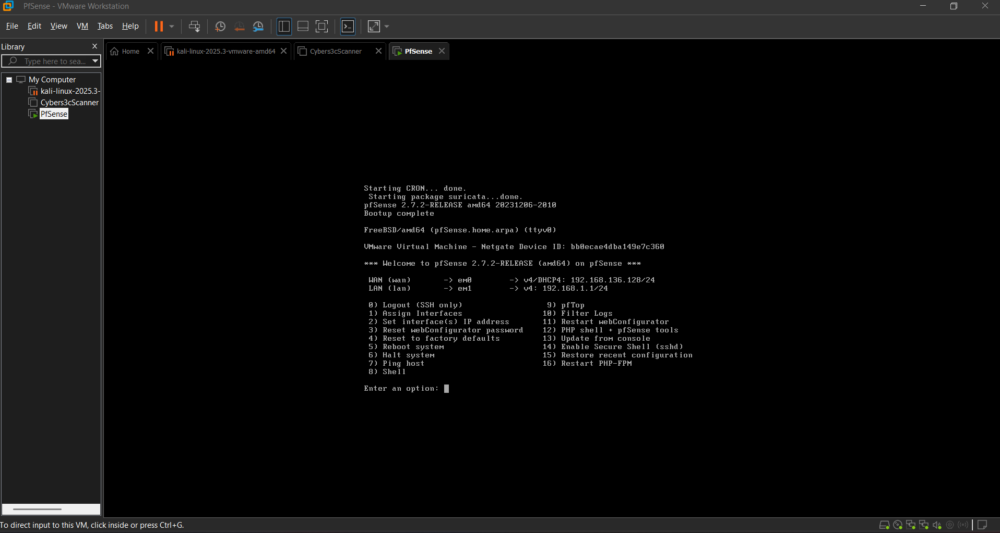

# pfSense Firewall Hardening & Network Segmentation Lab

This repository documents the practical implementation, configuration, and hardening of an enterprise-grade open-source firewall using the **pfSense** platform, aligned with industry best practices for corporate network security.

## 🎯 Project Objectives
* Design and implement robust network segmentation to mitigate lateral movement.
* Configure strict access control policies (Firewall Rules).
* Deploy traffic inspection and value-added network services (IDS/IPS, Secure DNS).

## 🗺️ Network Architecture & Segmentation
The infrastructure was divided into three distinct, isolated security zones:
1. **WAN (Wide Area Network):** The untrusted interface connected to the Internet (simulated/lab environment).
2. **LAN (Local Area Network):** A restricted internal network dedicated to corporate users and workstations.
3. **DMZ (Demilitarized Zone):** An isolated zone hosting public-facing services (e.g., a Web Server) ensuring that a compromise here does not impact the internal LAN.
### Lab Screenshots & Topology

## ⚙️ Implemented Configurations

### 1. Firewall Rules
* **Default Deny:** An implicit block policy applied to all traffic that is not explicitly authorized.
* **DMZ Isolation:** Rules tailored to allow WAN traffic only to specific web server ports (e.g., 80/TCP and 443/TCP), while strictly prohibiting any DMZ-initiated connections toward the LAN.
* **Anti-Lockout & Management Hardening:** Restrained WebGUI administrative access exclusively to a dedicated IP/segment within the LAN using a customized management port.

### 2. Core Network Services
* **DNS Resolver (Unbound):** Configured with DNS over TLS (DoT) for enhanced privacy and DNSSEC validation.
* **DHCP Server:** Static mapping pools implemented to ensure predictable IP assignment for streamlined asset auditing.

## 🛡️ System Hardening (pfSense)
* Changed default administrative credentials (`admin` / `pfsense`).
* Disabled plain HTTP web administration, enforcing HTTPS-only connections with modern TLS cipher suites.
* Enabled `Block bogon networks` and `Block private networks` on the WAN interface to mitigate spoofing vectors.

---
*Note: This project was developed strictly for educational purposes and to demonstrate practical network security competencies.*
